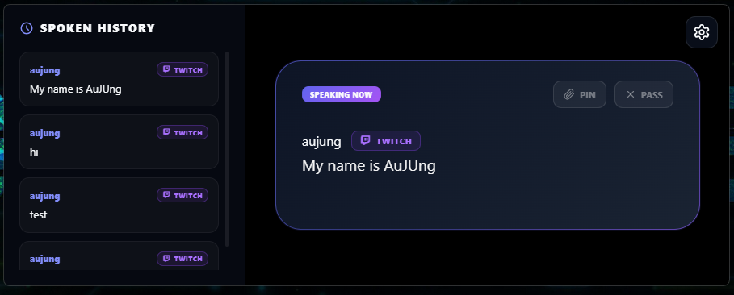

# Chat Alert

**Read Twitch chat messages aloud with a sleek overlay and customizable voices.**

Chat Alert connects to your Twitch channel, reads incoming chat messages using Windows text-to-speech, and displays them in a frameless, always-on-top overlay. Perfect for streamers who want to engage with chat without constantly reading the screen.

## Features

- 🎙️ **Real-time TTS** — Reads chat messages aloud using Windows voices (supports Thai and many other languages)
- 👁️ **Overlay UI** — Sleek, frameless overlay that shows the current message and upcoming queue
- ⌨️ **Hotkeys** — Quickly toggle the overlay and pin important messages
- 📋 **Message Queue** — Manages message playback with customizable queue size
- ⚙️ **Easy Setup** — Simple configuration with your Twitch credentials
- 🎨 **Customizable** — Adjust speech rate, fade delay

## Quick Start

1. Download the `.exe` from the current release.
2. Open and configure the app.
3. Use it.

## References

- Twitch token: generate a chat OAuth token at [Antiscuff OAuth](https://antiscuff.com/oauth/).
- Gemini token: create an API key in [Google AI Studio](https://aistudio.google.com/app/apikey).

## License

MIT
